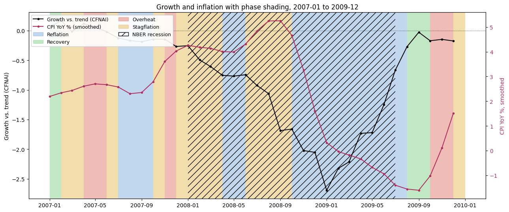
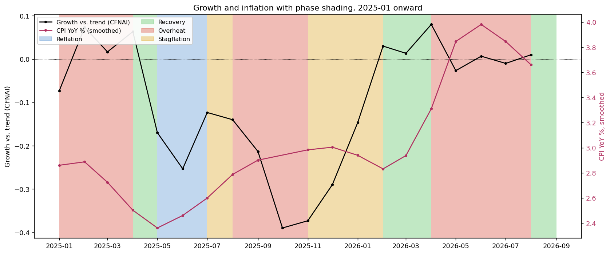

# Investment Clock

Growth direction x inflation direction gives four phases (Recovery, Overheat, Stagflation, Reflation),
following Greetham (Merrill Lynch, 2004). Signals use a 2-month publication lag and real monthly returns
(1973-04 to 2026-08). Growth is a 2-of-3 vote of industrial production, the Chicago Fed National Activity
Index and unemployment; inflation is the direction of smoothed CPI YoY.

## Run the app
```
pip install -r requirements.txt
streamlit run app/streamlit_app.py
```

## Update the data
```
cd code
python investment_clock.py
```
Then rerun the app. Data comes from FRED, Yahoo Finance and Ken French's library, revised values only
(no real-time vintages). Educational research, not investment advice.

## Layout
- `app/` Streamlit app
- `code/` model script and notebook
- `results/model_outputs/` CSVs the app reads

## Example charts

Both charts plot growth versus trend (CFNAI, black line, left axis) and smoothed CPI inflation (pink line, right axis).
The background colour is the phase from the three-factor composite vote plus CPI direction: green = Recovery,
red = Overheat, gold = Stagflation, blue = Reflation. Hatched bars mark NBER recessions. The chart titles in the
images are older and don't say it, but the shading comes from the composite vote, not from CFNAI alone.

### 2007 to 2009: the financial crisis



- The hatched bar (Jan 2008 to Jun 2009) is the NBER recession.
- Early 2008 is mostly Stagflation: growth is already below trend and falling while inflation climbs towards 5%.
- From late 2008 the model reads Reflation: CFNAI collapses to about -2.7 and inflation drops below zero.
- Recovery appears in late 2009 as growth rebounds.
- Before the recession (2007) the label flips between Recovery, Stagflation, Overheat and Reflation every few months. The signal is noisy when growth is near trend.

### 2025 to 2026: the current period



- No NBER recession is flagged in this window, so there is no hatching.
- The sequence is Overheat (Jan to Mar 2025), Recovery (Apr), Reflation (May and Jun), Stagflation (Jul), Overheat (Aug to Oct), Stagflation (Nov to Jan 2026), Recovery (Feb and Mar), Overheat (Apr to Jul) and Recovery (Aug 2026).
- October 2025 has no label because the CPI release was cancelled during the government shutdown.
- CFNAI stays within about -0.4 and +0.1, so growth is close to trend the whole time. A phase change here can come from a very small move, and the label should be read as "growth edging up or down", not as a large swing.
- The 2026 Overheat stretch lines up with inflation rising from about 2.8% to about 4.0%. The model still calls it Overheat in the months after inflation peaked, because direction is measured against three months earlier.

### How to read them
A phase is a statement about direction, not level: growth rising or falling, and inflation rising or falling, compared with three months earlier.
The signal is lagged two months and uses revised data, so it can't be traded exactly as shown.
